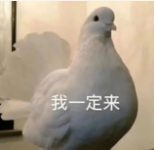

# SegBench: A simple toolbox for Implementing Binary Segmentation

## Introduction

This project aims to build up a benchmark for **fair and solid comparisons** with the *state-of-the-art* segmentation methods. Motivated by [sssegmentation](https://github.com/SegmentationBLWX/sssegmentation), we hope to excel at the **Binary Segmentation** which is prevailing in minority tasks but also matters, e.g., **Shadow Detection, Camouflage Object Detection, Saliency Object Detection, and most of Medical Image Segmentation**. 

In a sum, we:

* Present read and deployment friendly codes for Training/Testing
* Present wide range of cutting-edge methods comparisons with several datasets
* Provide full experiment details including the logs, ~~tensorboard~~（too large, forget it **😅**）, and ckpt

<center><b>Give me some time to construct this project :)</b></center>




## Environments

The codes mainly rely on the **[HuggingFace](https://huggingface.co/)🤗**, including the Distributed Training (**[Accelerate](https://huggingface.co/docs/accelerate/index)**), Model Architecture (**[Transformers](https://huggingface.co/docs/transformers/index)**).

My stable version for these packages are:

```
pip install accelerate==0.20.3
pip install transformers
```

Pytorch is suggested to update with version `1.12.1` or higher. I will try more efficient implementations with [Flash Attention](https://pytorch.org/blog/pytorch2-2/) , [Torch Compile](https://pytorch.org/tutorials/intermediate/torch_compile_tutorial.html) and etc. in the future.

## Datasets

### Shadow Detection

* BIGSHA(coming soon): High Resolution Shadow Detection
* [SBU](https://www3.cs.stonybrook.edu/~cvl/projects/shadow_noisy_label/index.html) (ECCV16): Image Shadow Detection
* [CUHK-Shadow ](https://github.com/xw-hu/CUHK-Shadow)(TIP21): Image Shadow Detection, larger one 

### Camouflaged object detection

* [COD10K](https://openaccess.thecvf.com/content_CVPR_2020/papers/Fan_Camouflaged_Object_Detection_CVPR_2020_paper.pdf) (CVPR20): Image Camouflaged object detection

### Transparent Segmentation

*  [Trans10k ](https://xieenze.github.io/projects/TransLAB/TransLAB.html)(ECCV20) : Transparent objects segmentation:

### Medical Image Segmentation

*  [ISIC ](https://www.isic-archive.com/): Skin Lesion Segmentation
* [BUSI](https://www.kaggle.com/datasets/aryashah2k/breast-ultrasound-images-dataset) : Breast Cancer Ultrasound Image Segmentation

### And So On

## Loss Function

We take use of BinaryCrossEntropy and [lovasz-hinge](https://openaccess.thecvf.com/content_cvpr_2018/papers/Berman_The_LovaSz-Softmax_Loss_CVPR_2018_paper.pdf) to supervise the segmentation. 

```latex
L = L_{bce} + 0.2\times L_{hinge}
```


## Model ZOO and CMD

* Please click the details to check the documents, including commands, ckpt and logs.

* Please modify the pretrained path in the `CustomCode` in your own server.

| Model                                                        | Pretrained or Backbone                                       | BIGSHA (coming soon)                    | Trans10K                                | TODO |
| ------------------------------------------------------------ | ------------------------------------------------------------ | --------------------------------------- | --------------------------------------- | ---- |
| Segformer [[Paper](https://proceedings.neurips.cc/paper/2021/file/64f1f27bf1b4ec22924fd0acb550c235-Paper.pdf)] [[CustomCode](./benchmarks/segformer.py)] | [MiT-B3](https://huggingface.co/nvidia/segformer-b3-finetuned-ade-512-512/tree/main) | [Click See Details](./doc/Segformer.md) | [Click See Details](./doc/Segformer.md) |      |
| Deeplabv3 [[Paper](https://arxiv.org/abs/1802.02611)] [[CustomCode](./benchmarks/deeplab.py)] | [ResNet-101](https://download.pytorch.org/models/deeplabv3_resnet101_coco-586e9e4e.pth) | TODO                                    | TODO                                    |      |
| UperNet+Swin-B [[Paper](https://openaccess.thecvf.com/content_ECCV_2018/papers/Tete_Xiao_Unified_Perceptual_Parsing_ECCV_2018_paper.pdf)] [[CustomCode](./benchmarks/UperNet.py)] | [Swin-B](https://huggingface.co/openmmlab/upernet-swin-base/tree/main) | TODO                                    | TODO                                    |      |
| VMamba [[Paper](https://arxiv.org/abs/2401.10166)] [CustomCode (TODO)] | TODO                                                         | TODO                                    | TODO                                    |      |
| TODO MORE                                                    | TODO                                                         | TODO                                    | TODO                                    |      |

## Future works

So many blanks need to fill  :)

Keep Patience :)

Drop emails to haipengzhou856@gmail.com or directly post the issues here if you have any question.

## Acknowledgement

Thanks for all the open-source contributors. Please considering those reproduced methods.

## License

Currently, this project is non-commercial and only for academic usage.